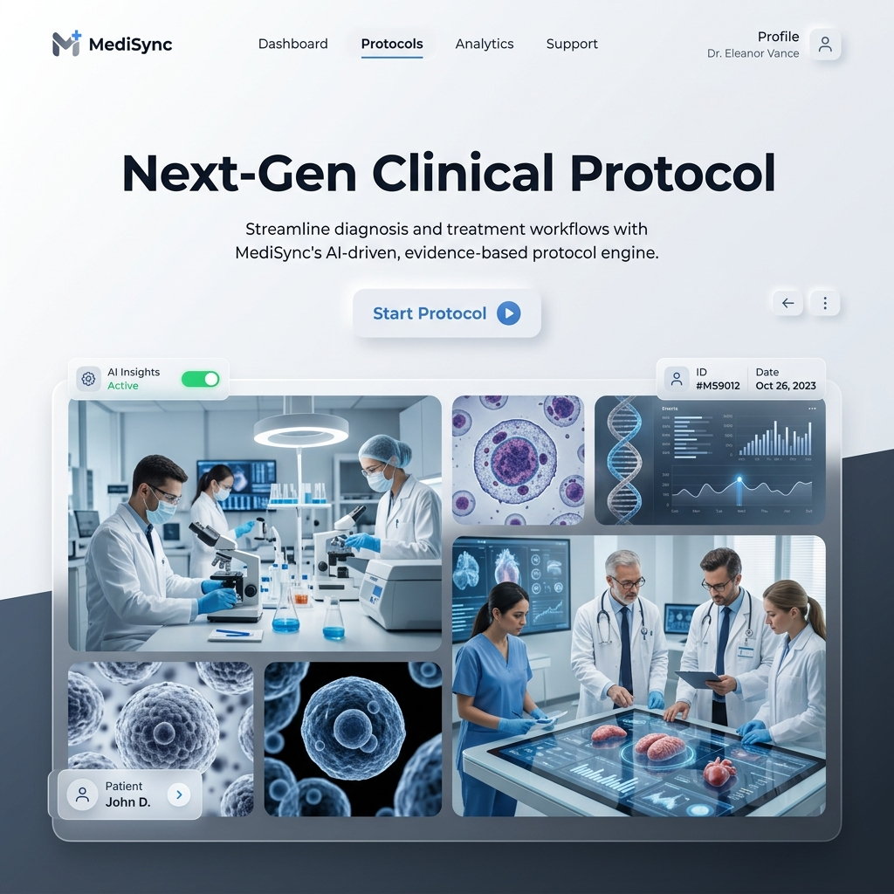
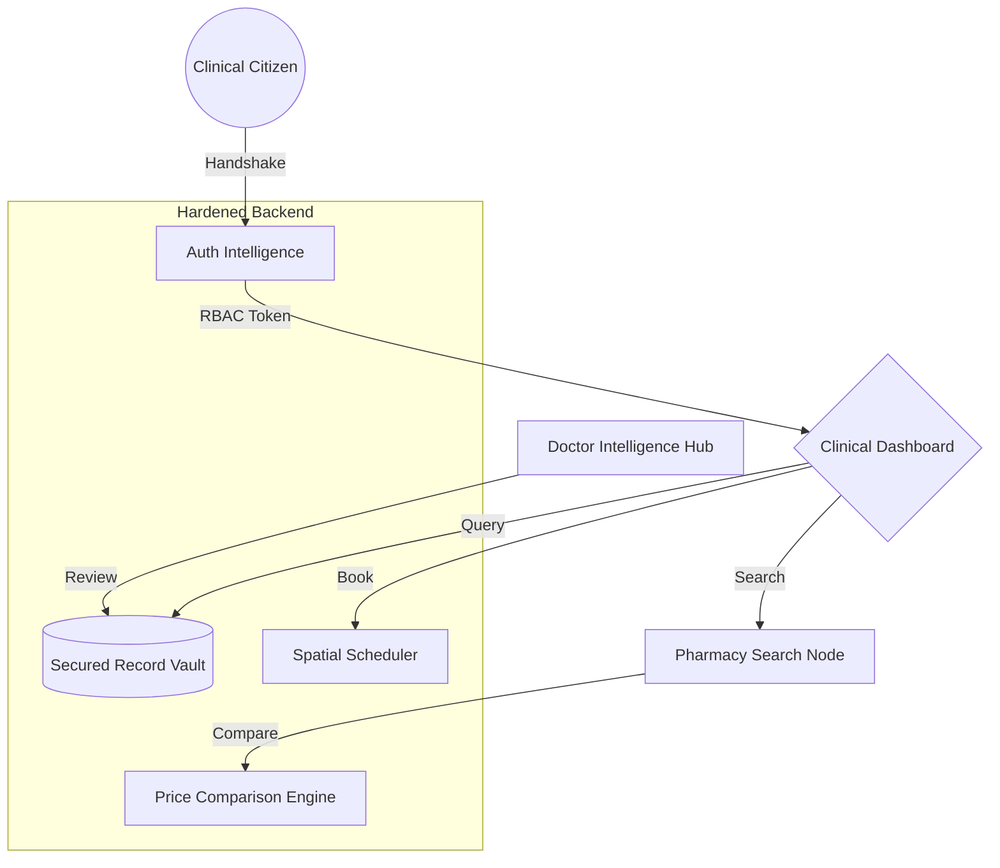
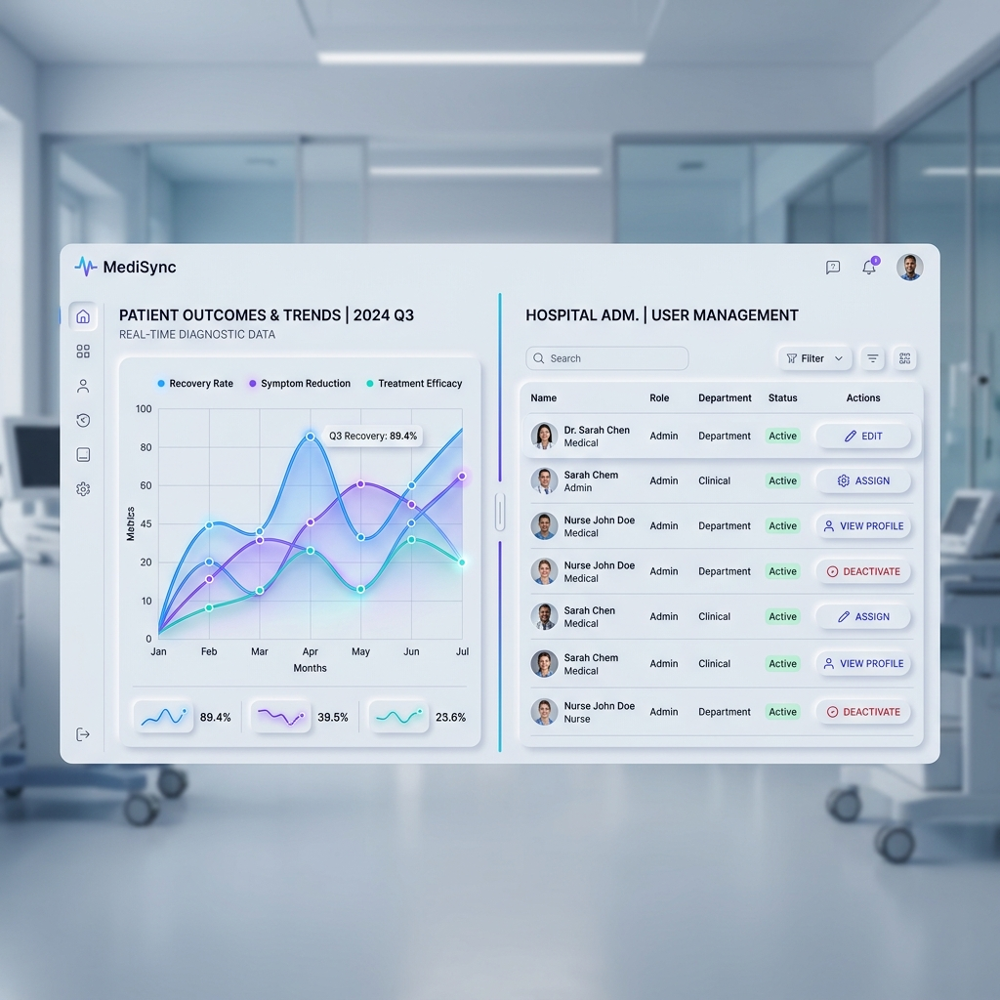

<div align="center">
  

  <br />
  <br />

  # 🏥 MediSync: Next-Gen Clinical Protocol

  ### _Synchronizing Specialist Consultations, Pharmacy Fulfillments, and Patient Diagnostics in a Unified, Post-Quantum Encrypted Environment._

  <br />

  | Deployment Node | Operational Link | Access Protocol |
  | :--- | :--- | :--- |
  | **Design Prototype** | [](https://www.figma.com/proto/K0gasIFRWzrAlnWWhUy5vE/Untitled?page-id=3%3A2&node-id=3-125&p=f&viewport=463%2C474%2C0.05&t=AHoOQahMQPxluVVC-1&scaling=min-zoom&content-scaling=fixed&starting-point-node-id=3%3A125) | UI/UX Blueprint |
  | **Production Node** | [](https://medi-sync-rho.vercel.app) | Live Clinical Environment |
  | **API Intelligence** | [](https://documenter.getpostman.com/view/50839186/2sBXqJLgPy) | Technical Handshake Docs |
  | **Backend Cluster** | [](https://medisync-gxiy.onrender.com) | Clinical Logic Node |
  | **Video Walkthrough** | [](https://youtu.be/0iB2YEnbtSw?si=_XlKFlHLEPg5F1aQ) | Clinical Operation Guide |

  <br />

  > **The MediSync Mission**: To bridge the fragmentation in global healthcare by orchestrating a high-fidelity, real-time data matrix where patient records and pharmaceutical intelligence coexist in absolute synchronization.

  ---
</div>

## 🧩 The Clinical Problem
Modern healthcare suffers from **Data Fragmentation**. Patient records are siloed across institutions, pharmaceutical prices vary wildly without transparency, and the synchronization between doctors and patients is often manual and error-prone. This leads to delayed treatments, high costs, and compromised patient safety.

## 💡 The MediSync Solution
MediSync provides a **Unified Clinical Intelligence Matrix**. It aggregates medical records into a secured "Clinical Vault," enables real-time price comparison across verified pharmacy nodes, and orchestrates appointments through a spatial calendar interface. Built with the **Clinical Atelier** design philosophy, it offers a tactile, neumorphic environment for zero-latency healthcare management.

---

## 🛠️ Technology Stack & Architecture

| System Layer | Intelligence Node | Core Technology Stack |
| :--- | :--- | :--- |
| **Frontend Core** | Clinical Interface | [](https://react.dev/) [](https://vitejs.dev/) |
| **Styling & UI** | Visual Architecture | [](https://tailwindcss.com/) [](https://mui.com/) |
| **Motion Physics** | Animations | [](https://www.framer.com/motion/) [](https://greensock.com/gsap/) |
| **State Matrix** | Logic Layer | [](https://redux-toolkit.js.org/) |
| **Backend Runtime** | Clinical API | [](https://nodejs.org/) [](https://expressjs.com/) |
| **Data Dossier** | Intelligence Storage | [](https://www.mongodb.com/) [](https://mongoosejs.com/) |
| **Z+ Security** | Auth & Encryption | [](https://jwt.io/) [](https://www.npmjs.com/package/bcrypt) |

---

## 🔐 Z+ Hardened Backend Security
MediSync implements a **Zero-Trust Security Architecture** with multi-layer orchestration:

| Security Layer | Technology | Operational Impact |
| :--- | :--- | :--- |
| **HTTP Hardening** | `Helmet.js` | Enforces strict CSP, HSTS, and Frame-Guard policies. |
| **Injection Firewall** | `express-mongo-sanitize` | Prevents NoSQL injection by stripping operator-prefix keys. |
| **Cross-Site Shield** | `xss-clean` | Sanitizes user input to block malicious script injections. |
| **Traffic Orchestrator** | `express-rate-limit` | Multi-tier limiting for Auth (5/15m) and Admin (10/15m) nodes. |
| **HPP Protection** | `hpp` | Guards against HTTP Parameter Pollution attacks. |
| **Payload Guard** | `Body-Parser Limits` | Strict 5MB limit on incoming clinical dossiers. |
| **Audit Surveillance** | `Morgan + Custom Loggers` | Real-time tracking of security-critical handshakes. |

---

## 🧬 System Architecture Matrix


---

## 🚀 Strategic Orchestration Nodes (Features)

### 📊 Strategic Intelligence Matrix
- **SVG Spline Analytics**: Animated growth curves tracking clinical metrics.
- **Dynamic Timeline**: Switch between Monthly/Yearly data matrices with sub-second latency.
- **Admin Surveillance**: Real-time monitoring of system-wide clinical activity.

### 🛡️ Secured Record Vault
- **Clinical Dossier**: High-fidelity management for Patients and Doctors.
- **Z+ Security**: Post-quantum encrypted document storage with "Self-Healing" data URIs.
- **Multi-Format Support**: Ingest clinical artifacts (PDFs, Images) with automatic metadata indexing.

### 💊 Pharmacy Synchronization
- **Price Parity**: Real-time price comparison across verified pharmacy nodes.
- **Nearby Discovery**: Geolocation-aware pharmacy directory with verification badges.
- **Registry Handshake**: Specialized registration portal for pharmacy nodes.

### 📅 Advanced Appointment Protocol
- **Spatial Calendar**: Tactile interface for booking and tracking clinical sessions.
- **Auto-Sync**: Background synchronization of doctor schedules and patient timelines.
- **Tele-Consult Integration**: Ready for secure video handshakes.

### 🆘 Emergency Resilience Node
- **One-Tap Protocol**: Rapid access to emergency clinical services.
- **Critical Data Broadcast**: Seamlessly share critical vitals with emergency responders.

### 🤝 Peer-to-Peer Clinical Sharing
- **Secure Handshake**: Share clinical dossiers with specialists through encrypted link protocols.
- **Access Revocation**: Instantly terminate sharing permissions from the Dashboard.

---

## 📂 Project Structure

```text
mediSync/
├── frontend/               # Clinical Interface (Vite + React)
│   ├── src/
│   │   ├── components/     # High-fidelity reusable UI nodes
│   │   ├── context/        # Auth & Clinical State providers
│   │   ├── pages/          # Unified page modules (RBAC protected)
│   │   ├── hooks/          # Tactical custom logic hooks
│   │   └── assets/         # Clinical design tokens & media
├── backend/                # Clinical Intelligence API (Node.js)
│   ├── src/
│   │   ├── controllers/    # Data orchestration logic
│   │   ├── models/         # Mongoose clinical schemas
│   │   ├── routes/         # API endpoint registry
│   │   └── middleware/     # Hardened security & RBAC guards
└── README.md               # Project Dossier
```

---

## 📸 Clinical Interface Gallery

<div align="center">
  
  <p><i>The MediSync Platform Overview: A Unified Hub for Clinical Operations</i></p>

  <br />

  
  <p><i>The Secured Clinical Dossier: Neumorphic Grid & Timeline Synchronization</i></p>

  <br />

  
  <p><i>Admin Control Node: Strategic Surveillance and Real-Time Analytics</i></p>
</div>

---

## 🛠️ Tactical Deployment Protocol

### **1. Clone the Protocol**
```bash
git clone https://github.com/priyabratasahoo780/Resume-generater.git
cd Resume-generater/mediSync
```

### **2. Orchestrate Backend Intelligence**
```bash
cd backend
npm install
# Create .env and inject Clinical Key Matrix (see below)
npm start
```

### **3. Orchestrate Clinical Interface**
```bash
cd ../frontend
npm install
npm run dev
```

---

## 🔑 Clinical Key Matrix (Environment)

| Key | Description | Default / Example |
| :--- | :--- | :--- |
| `PORT` | API Server Port | `5000` |
| `MONGO_URI` | MongoDB Connection String | `mongodb+srv://...` |
| `JWT_SECRET` | High-Entropy Auth Secret | `YourSecretKey` |
| `NODE_ENV` | Tactical Environment | `development` |
| `SMTP_HOST` | Clinical Email SMTP | `smtp.mailtrap.io` |

---

## 🤝 Clinical Ethics & Contribution
We welcome contributions that align with our mission. Please adhere to the **MediSync Tactical Protocol**:
1. **Dossier Selection**: Choose an open clinical node.
2. **Branch Creation**: Use tactical naming (e.g., `feature/medicine-sync`).
3. **Audit**: Ensure code meets the modularization mandate.

---

## ⚖️ License
This project is licensed under the **MIT License**.

<br />

<div align="center">
  
  <br />
  <br />

  ### 👨‍💻 Strategic Clinical Engineering By

  ## **Priyabrata Sahoo**
  _Full-Stack Clinical Systems Architect_

  <br />

  [](https://github.com/priyabratasahoo780)
  [](https://www.linkedin.com/in/priyabratasahoo780/)
  [](https://github.com/priyabratasahoo780)

  <br />

  **MediSync Core Technologies © 2026**
  <br />
  _Synchronizing the Future of Global Healthcare_
</div>
